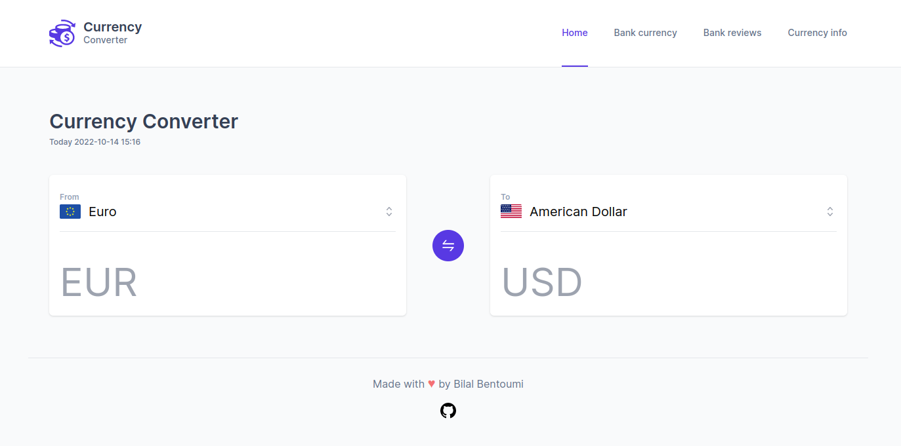

# Currency Converter

Simple currency converter using [Currency Rates API](https://github.com/fawazahmed0/currency-api). The app was created using React and tailwind css.

## UI Example

[Live preview](https://bilalbentoumi.github.io/currency-converter)

## Running the project

- go to project directory.
- run `npm install` or `yarn` to install packages (just a first time).
- run `npm start` or `yarn start` (it runs the app in the development mode and opens http://localhost:3000 automatically to view in the browser).

## Testing the project
In the project directory run `npm test`. It launches the test runner in the interactive watch mode.
Run `npm coverage` to see coverage report.

## Production build
To run a production build use command `npm run build` or `yarn build`. It builds the app for production to the build folder.

## License
This project is licensed under the [MIT] License - see the LICENSE.md file for details.